# FIXYL


FIXYL is a tool for testing and verifying software that uses the [FIX protocol](https://www.fixtrading.org/what-is-fix/). It allows establishing FIX sessions and exchanging (and manipulating) FIX messages. As this tool can currently only act as a FIX client, it can only be used to test applications that act as a FIX server.

The tool is based on the message definition format used in [QuickFix](https://github.com/quickfix/quickfix/tree/master/spec) and the tool provides support for all standard and custom FIX dictionaries across version 4.x and 5.x of the FIX protocol. It features a wide variety of options to support the testing and debugging of FIX gateways. You can find a sample definition [here](https://github.com/quickfix/quickfix/blob/master/spec/FIX44.xml).

This tool is created using React, is based on Electron and supports cross-platform builds.


## Installation

### Installing from binaries

Pre-built binaries can be downloaded from the [Releases Page](https://github.com/yaalalabs/fixyl/releases). Make sure to use the installer for your operating system.

|OS         |Instructions                 |
|-----------|-----------------------------|
|Windows    | Download the .exe file      |
|Mac        | Download the .dmg file      |
|Linux      | Download the .AppImage file |


### Building from source

Building from source requires NodeJS 12 or higher. Note that this step can be initiated from all major operating systems (Linux, Windows, MacOS) and produces an installer for that operating system.

**For production:**

```bash
npm install
npm run build
```

Once the build is complete, the installer can be found inside the `dist` directory.

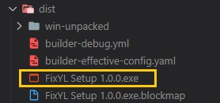

**For development:**

```bash
npm install
npm run start
```

This launches a React development server on `localhost:3000`, and starts an Electron application instance pointing to it. Make sure that port `3000` is not already occupied by some other program.

## Usage

### First start-up

Once you start the application for the first time, it will ask for a `working directory` to store configuration files. Set this to a valid directory.

This directory is used for storing user configurations such as profiles and favorites. Deleting this directory manually would remove such configurations and would cause the application to prompt for a working directory the next time it is launched.

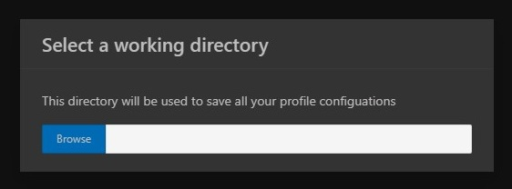

### Adding a new profile

A profile contains all of the information required for creating a new FIX session. You may open the profile creation form by clicking on the `Profile` menu item and clicking the `+` button on the top of the opened panel.

Once this form is opened, you should enter the following information of the target FIX server:

|Field               |Description                                             |
|--------------------|--------------------------------------------------------|
|Name                |Name of the profile                                     |
|IP Address          |IP address of the targetserver                          |
|Port                |Port address of the target server                       |
|HB Interval         |Heartbeat interval for the session                      |
|SenderCompId        |Username to use for the login and sender identification |
|Password            |Password of the above user to use for login             |
|TargetCompId        |Target system/firm identification                       |
|Dictionary Location |Location of the FIX dictionary definition XML file      |
|SSL Enabled         |Whether SSL is enabled or not                           |
|SSL Server Name     |SSL Server Name (for SNI) if different from host        |
|SSL CA Certificate  |CA certificate to be used for the handshake (.pem)      |
|SSL Certificate     |Self-signed certificate if not using a public one (.pfx)|
|Certificate Password|Password to decipher self-signed certificate            |

Pressing `Save` will create a new profile with the entered information.

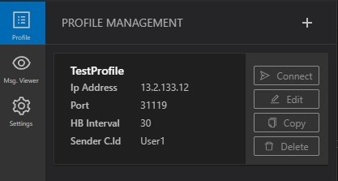

The profile information will be saved in a configuration file inside the `working directory` set for the application.

### Starting a FIX session

Open the `Profile` menu and click the connet button of the profile that you have previously created. This will open a TCP connection to the FIX server mentioned in the profile, A new tab will be opened in the main window for the established session.

If the connection is successfull, the connection indicator will turn `green` and the state will be presented as `CONNECTED`. 

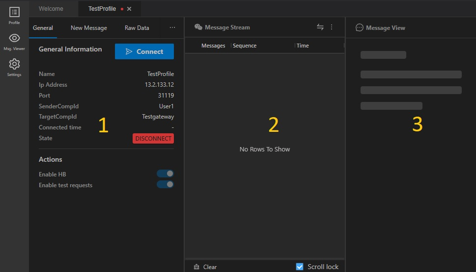

## FIX Session Management

Each FIX session tab consists of the following 3 sections:

1. Session management
2. Message streams
3. Message preview

### Session Management

This section provides an overview of the session and tools required to interact with the active session. The following tabs are available in this section.

|Section     |Description                                                                                                                                                                                                                                                                                                                                                                                                      |Screenshot                                                                      |
|------------|-----------------------------------------------------------------------------------------------------------------------------------------------------------------------------------------------------------------------------------------------------------------------------------------------------------------------------------------------------------------------------------------------------------------|--------------------------------------------------------------------------------|
|General     |Provides basic information on the FIX session, such as connection details and the status. It also provides the functionality to `connect` and `disconnect` the session.                                                                                                                                                                                                                                          |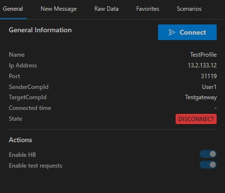   |
|New Message |Use this to send a new message through your FIX session. A message definition can be found using the dropdown menu (which supports auto complete). Selecting a messsage definition will prompt a form to fill the relevant fields before sending the message. You can also add the message you have saved to your favorites for later use. Refer [FIX Message Form](#fix-message-form) for more information. |                                                                                |
|Raw Data    |This is another way of sending a message. If you have a raw FIX message with printable field separators, use this tab to send it.                                                                                                                                                                                                                                                                                |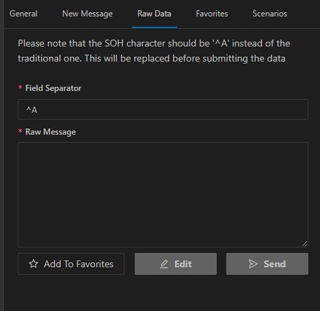 |
|Favorites   |All the favorites that you have saved previously are listed here. You can select a saved favorite message and send it.                                                                                                                                                                                                                                                                                             |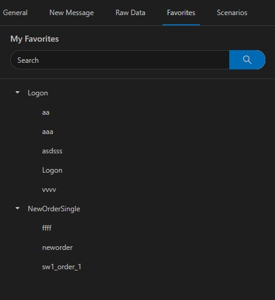 |
|Scenarios   |[EXPERIMATAL] This section gives users the ability to add automated testing for a message flow to cover a scenario. Refer [Scenario Configuration](#scenario-configuration) section for more information.                                                                                                                                                                                                    |                                                                                |

### Message Stream

This section shows all incoming and outgoing messages of the session. You can filter by `Heartbeat` , `In-coming` and `Out-going` messages.

You can select a message to get a preview of it. You can also select two messages (by selecting while pressing `Ctrl`) and click `View Diff` to compare the selected two messages in the message stream.


### Message Preview

This section visualizes a message selected in the message stream. 

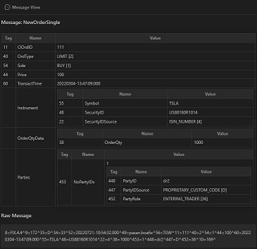

Each message is shown in two formats.

1. Decoded format where fields are shown in a tabular manner.
2. Raw format where raw data of the message is shown. Raw data of the message can be copied by clicking on this section.

## FIX Message Form

This form is used for editing messages before they are sent on the session. It can also be used for adding a configured message to the list of favorites for later use.

Following are some noteworthy features of this form:

1. If you press `Ctrl + F` you will get a search panel for searching through message fields.
2. The form also supports auto-generated fields. In order to use this, set the value of the field to `{auto-gen}`. Currently, auto generation of values are only supported on FIX fields of type `string`, `char`, `int`, `float`, `utctimestamp`, `monthyear`, `utcdateonly`, and `utctimeonly`. For example, if a date/time field is set to auto generate, the field value would be auto populated with the date always being set to the current date.

## Scenario Configuration

This section gives the user the abiity to configure test scenarios. A scenario can have multiple stages and each stage has an input and an output. Both input and output can have mutiple messages and each can be selected either from your favorites or manually.

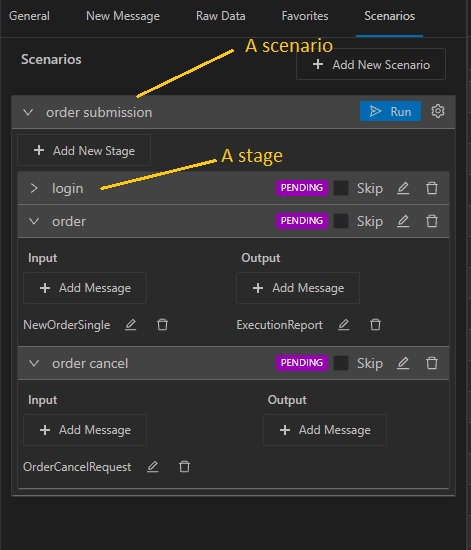

Execution is done stage by stage and the application will send each message in the input list and check the received messages against the ones mentioned in the output list. Each output message should have the field values that you want to check when the actual message is received. You can exempt a field from this validation by not having them in the  output messages.

You can also capture field values from the output message and use it in an input message. In the above screenshot, the `order` stage contains an input message for submitting a new order and the output message as the execution report that can be recieved if the order submittion is successful. 

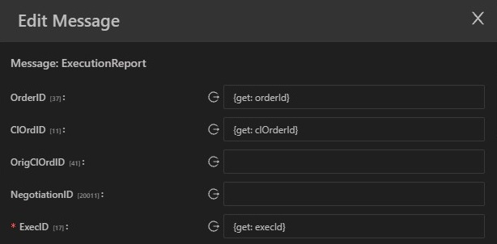

The values recieved from the execution report can be captured using `{get: <unique name>}` tag.

The captured values are used in the next stage of this example by using `{set: <unique name>}` to send an order cancellation request.

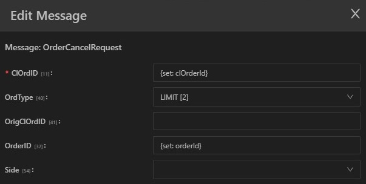

IMPORTANT: This feature is currently in an experimental stage so you may find some issues. 

## License 

[](https://opensource.org/licenses/Apache-2.0)

## Contribution

You may contribute to this project in any of the following manners.

* Use it in your work, and tell us about your experience. You can suggest changes, propose new features and report bugs.
* Better yet, fix bugs and implement features and submit your contribution as a pull request. We will review and merge. Note that all code contributed in this manner would be published under the same license terms as the main project.

---

Copyright 2022 [Yaala Labs](https://yaalalabs.com)


